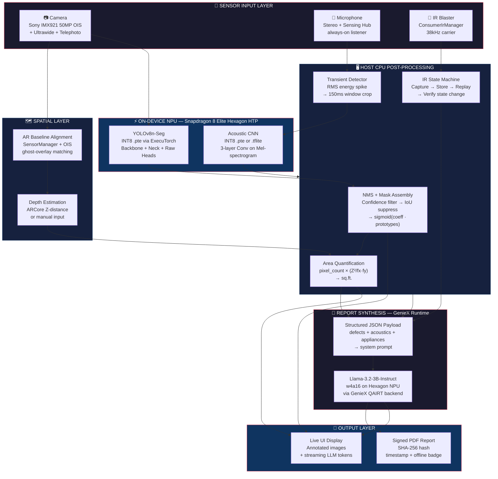
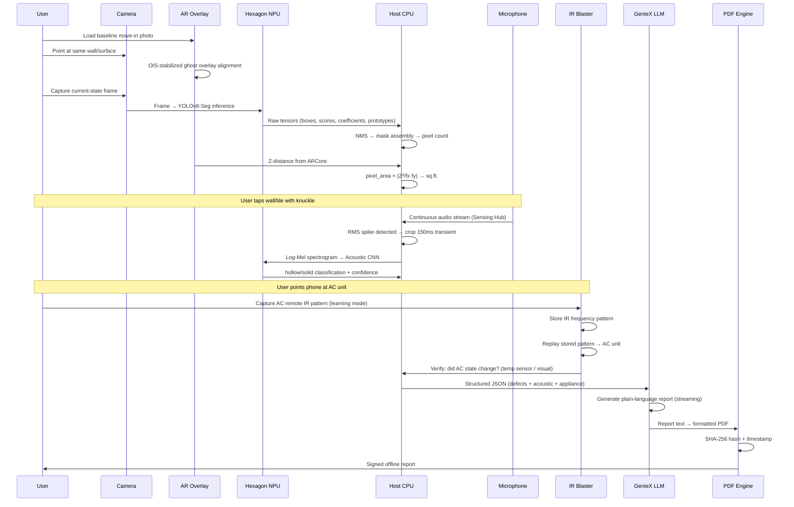
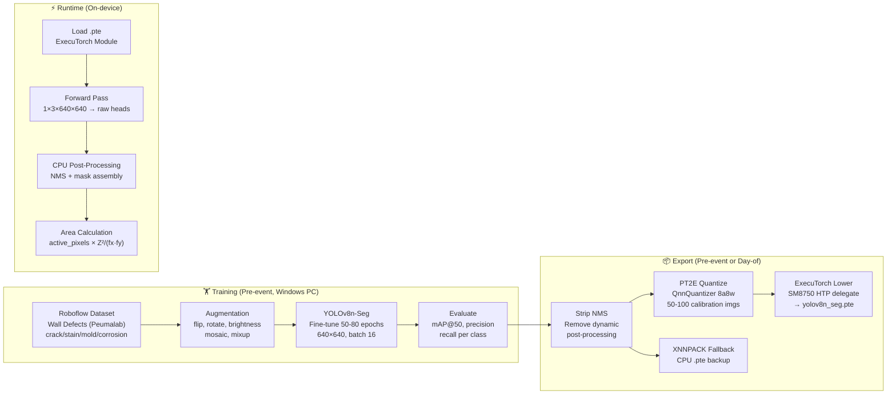
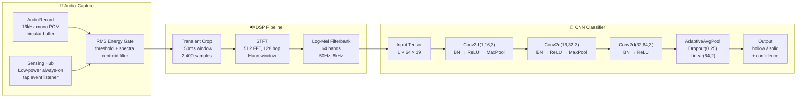
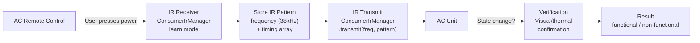
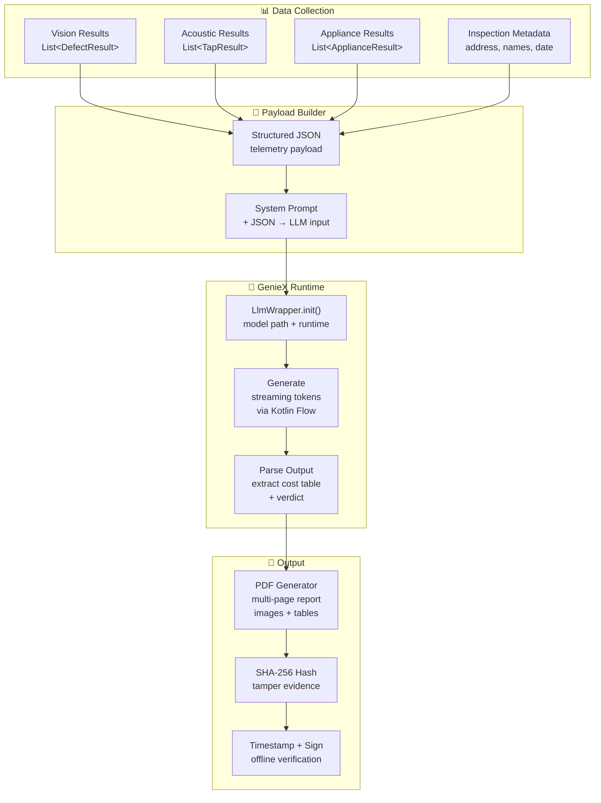
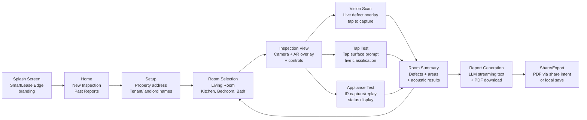
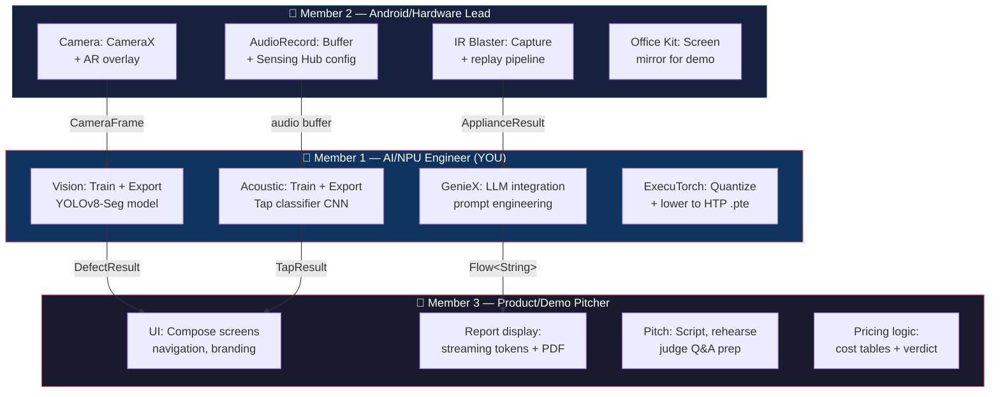

# SmartLease Edge — Full System Implementation Plan

## System Architecture



---

## Data Flow — Single Inspection Walkthrough



---

## Module Breakdown

---

### Module 1 — Sensor Input & Spatial Alignment

> **Owner**: Member 2 (Android/Hardware Lead)  
> **Member 1 dependency**: Receives stabilized camera frames + Z-distance

#### Components

| Component | Android API | Hardware Used | Purpose |
|-----------|------------|---------------|---------|
| Camera capture | CameraX (ImageAnalysis + Preview) | Sony IMX921 50MP w/ OIS | Capture wall/surface frames at 640×640 for inference |
| Ultrawide capture | CameraX lens selector | 50MP ultrawide lens | Full room/wall capture in single frame |
| Telephoto inspection | CameraX zoom | Periscope telephoto (100x digital) | Inspect small cracks/nail holes from distance |
| AR ghost overlay | SensorManager (accelerometer + gyroscope) + custom overlay | OIS-stabilized main camera | Align current view to baseline move-in photo |
| Depth estimation | ARCore Depth API or manual slider | Camera + ARCore | Provide Z-distance for pixel → sq.ft. conversion |
| Display | SurfaceView / TextureView | 6000-nit 2K LTPO display | Keep AR overlay visible in bright sunlit rooms |

#### Interface Contract → Member 1

```kotlin
data class CameraFrame(
    val bitmap: Bitmap,           // 640×640 RGB
    val depthMeters: Float,       // Z-distance to wall surface
    val timestamp: Long,          // System.nanoTime()
    val lensType: LensType        // MAIN, ULTRAWIDE, TELEPHOTO
)
```

---

### Module 2 — Vision Defect Segmenter

> **Owner**: Member 1 (AI/NPU Engineer) — YOUR MODULE

#### Architecture



#### Implementation Steps

**Step 2.1 — Dataset Pipeline**

| Task | Details |
|------|---------|
| Primary dataset | [Peumalab Wall Defects](https://universe.roboflow.com/peumalab/wall-defects) — download in YOLOv8-Seg format |
| Supplement | [Crack Segmentation Dataset](https://www.kaggle.com/datasets/lakshayarora/crack-segmentation-dataset) (11K images, convert binary masks → YOLO polygon format) |
| Own photos | 30-50 photos of Indian residential walls (cracks, water stains, paint peeling) — label in Roboflow |
| Augmentation | Horizontal flip, ±15° rotation, brightness/contrast jitter ±20%, mosaic |
| Target classes | `crack`, `stain`, `mold`, `corrosion`, `deterioration` (5 classes) |

**Step 2.2 — Training Pipeline**

```python
from ultralytics import YOLO

model = YOLO("yolov8n-seg.pt")  # Nano — smallest, fastest, NPU-friendly

results = model.train(
    data="datasets/wall-defects/data.yaml",
    epochs=80,
    imgsz=640,
    batch=16,              # Lower to 8 if GPU OOM
    patience=15,           # Early stopping
    augment=True,
    lr0=0.01,
    lrf=0.01,
    mosaic=1.0,
    flipud=0.5,
    fliplr=0.5,
    degrees=15.0,
    translate=0.1,
    scale=0.5,
    hsv_h=0.015,
    hsv_s=0.7,
    hsv_v=0.4,
    name="smartlease_v1",
    device="cpu",          # "0" for NVIDIA GPU
)
```

**Step 2.3 — Export (Decoupled Heads)**

```python
import torch
from ultralytics import YOLO

# Load trained model
model = YOLO("runs/segment/smartlease_v1/weights/best.pt")
pytorch_model = model.model.eval()

# Custom wrapper that outputs raw heads WITHOUT NMS
class YOLOSegRawHeads(torch.nn.Module):
    def __init__(self, model):
        super().__init__()
        self.model = model
        
    def forward(self, x):
        # Run backbone + neck + heads, skip NMS
        features = self.model.model[:10](x)  # Backbone + neck
        # Return raw detection + segmentation tensors
        # Exact layer indices depend on YOLOv8 architecture version
        return self.model.model[10:](features)

raw_model = YOLOSegRawHeads(pytorch_model)
example_input = torch.randn(1, 3, 640, 640)

# Export to ONNX first (validation)
torch.onnx.export(raw_model, example_input, "yolov8n_seg_raw.onnx", opset_version=17)

# ExecuTorch export (requires ExecuTorch installed with QNN backend)
from torch.export import export
exported = export(raw_model, (example_input,))
# ... PT2E quantization + QNN lowering (see Step 2 in your plan)
```

**Step 2.4 — CPU Post-Processing (Kotlin)**

```kotlin
object YoloPostProcessor {
    fun processRawOutput(
        boxes: FloatArray,        // N × 4 (x, y, w, h)
        scores: FloatArray,       // N × num_classes
        maskCoeffs: FloatArray,   // N × 32
        prototypes: FloatArray,   // 32 × 160 × 160
        confThreshold: Float = 0.3f,
        iouThreshold: Float = 0.45f,
        depthMeters: Float,
        focalLengthPx: Float
    ): List<DefectResult> {
        
        // 1. Filter by confidence
        val candidates = filterByConfidence(boxes, scores, confThreshold)
        
        // 2. Non-Maximum Suppression
        val kept = nms(candidates, iouThreshold)
        
        // 3. Assemble masks: mask = sigmoid(coefficients · prototypes)
        val masks = kept.map { det ->
            val mask = dotProductAndSigmoid(det.coefficients, prototypes)
            mask // Binary 160×160 mask
        }
        
        // 4. Calculate area in sq.ft.
        return kept.zip(masks).map { (det, mask) ->
            val activePixels = mask.count { it > 0.5f }
            val totalPixels = 160 * 160
            val areaFraction = activePixels.toFloat() / totalPixels
            val wallAreaSqM = (depthMeters * depthMeters) / (focalLengthPx * focalLengthPx)
            val areaSqFt = areaFraction * wallAreaSqM * 10.7639f
            
            DefectResult(
                className = det.className,
                confidence = det.confidence,
                areaSqFt = areaSqFt,
                mask = mask,
                boundingBox = det.box
            )
        }
    }
}
```

**Step 2.5 — Evaluation Targets**

| Metric | Target | Acceptable minimum |
|--------|--------|-------------------|
| mAP@50 | > 0.50 | > 0.30 |
| Precision | > 0.60 | > 0.40 |
| Recall | > 0.50 | > 0.35 |
| Inference time (NPU) | < 30ms | < 100ms |
| Inference time (CPU fallback) | < 200ms | < 500ms |

---

### Module 3 — Acoustic Impact-Echo Classifier

> **Owner**: Member 1 (AI/NPU Engineer) — YOUR MODULE

#### Architecture



#### Implementation Steps

**Step 3.1 — Data Collection**

| Source | Type | Count | Method |
|--------|------|-------|--------|
| Synthetic generation | Bootstrap | 100 hollow + 100 solid | `scipy.signal` impulse → bandpass → decay simulation |
| Real recordings | Primary | 50 hollow + 50 solid | Record on phone: tap hollow doors, drywall, concrete, solid walls |
| Augmented | Training boost | 3× real data | Pitch shift ±2 semitones, time stretch ±10%, SNR noise at 15/20/25 dB |

**Step 3.2 — Feature Extraction**

```python
import librosa
import numpy as np

def extract_mel_spectrogram(audio_path, sr=16000, n_fft=512, hop_length=128, n_mels=64):
    """Extract Log-Mel spectrogram from a tap recording."""
    y, sr = librosa.load(audio_path, sr=sr)
    
    # Detect tap onset (energy spike)
    onset_frames = librosa.onset.onset_detect(y=y, sr=sr, units='samples')
    if len(onset_frames) > 0:
        start = max(0, onset_frames[0] - 100)  # Slight pre-onset
        end = start + int(0.150 * sr)  # 150ms window = 2400 samples
        y = y[start:end]
    
    # Pad/trim to exactly 2400 samples
    y = librosa.util.fix_length(y, size=int(0.150 * sr))
    
    # Log-Mel spectrogram
    mel = librosa.feature.melspectrogram(
        y=y, sr=sr, n_fft=n_fft, hop_length=hop_length,
        n_mels=n_mels, fmin=50, fmax=8000
    )
    log_mel = librosa.power_to_db(mel, ref=np.max)
    
    return log_mel  # Shape: (64, 19) for 150ms at hop=128
```

**Step 3.3 — CNN Model**

```python
import torch
import torch.nn as nn

class TapClassifier(nn.Module):
    """Lightweight CNN for hollow/solid tap classification.
    Input: (batch, 1, 64, 19) Log-Mel spectrogram
    Output: (batch, 2) logits for [hollow, solid]
    Model size: ~150KB
    """
    def __init__(self):
        super().__init__()
        self.features = nn.Sequential(
            nn.Conv2d(1, 16, 3, padding=1),
            nn.BatchNorm2d(16),
            nn.ReLU(),
            nn.MaxPool2d(2),           # → (16, 32, 9)
            
            nn.Conv2d(16, 32, 3, padding=1),
            nn.BatchNorm2d(32),
            nn.ReLU(),
            nn.MaxPool2d(2),           # → (32, 16, 4)
            
            nn.Conv2d(32, 64, 3, padding=1),
            nn.BatchNorm2d(64),
            nn.ReLU(),
        )
        self.classifier = nn.Sequential(
            nn.AdaptiveAvgPool2d(1),   # → (64, 1, 1)
            nn.Flatten(),
            nn.Dropout(0.25),
            nn.Linear(64, 2),
        )
    
    def forward(self, x):
        x = self.features(x)
        x = self.classifier(x)
        return x
```

**Step 3.4 — Evaluation Targets**

| Metric | Target | Acceptable minimum |
|--------|--------|-------------------|
| Accuracy | > 90% | > 80% |
| Inference time (NPU) | < 3ms | < 10ms |
| Model size (.pte) | < 200KB | < 500KB |
| False positive rate (solid called hollow) | < 10% | < 15% |

---

### Module 4 — IR Appliance Verification

> **Owner**: Member 2 (Android/Hardware Lead)  
> **Member 1 dependency**: Receives `appliance_verified: Boolean` + `appliance_state: String`

#### Architecture



#### Key Android Code (Member 2 writes, Member 1 consumes)

```kotlin
class IrApplianceVerifier(private val context: Context) {
    private val irManager = context.getSystemService(Context.CONSUMER_IR_SERVICE) 
        as ConsumerIrManager
    
    // Pre-loaded IR patterns for common Chennai AC brands
    private val fallbackPatterns = mapOf(
        "Voltas" to IrPattern(38000, intArrayOf(/* timing */)),
        "Blue Star" to IrPattern(38000, intArrayOf(/* timing */)),
        "LG" to IrPattern(38000, intArrayOf(/* timing */)),
        "Daikin" to IrPattern(38000, intArrayOf(/* timing */)),
    )
    
    data class ApplianceResult(
        val name: String,
        val brand: String,
        val irTransmitted: Boolean,
        val stateChanged: Boolean,
        val status: String  // "functional" | "non_functional" | "ir_failed"
    )
}
```

#### Interface Contract → Member 1

```kotlin
data class ApplianceResult(
    val name: String,           // "Split AC"
    val brand: String,          // "Voltas"
    val irTransmitted: Boolean, // true if IR code was sent
    val stateChanged: Boolean,  // true if appliance responded
    val status: String          // "functional" | "non_functional"
)
```

---

### Module 5 — Report Synthesis Engine

> **Owner**: Member 1 (AI/NPU Engineer) — YOUR MODULE  
> **UI rendering**: Member 3

#### Architecture



#### Implementation Steps

**Step 5.1 — JSON Payload Schema**

```json
{
  "event": "Lease_Exit_Inspection",
  "property": {
    "address": "42 Thiruvalluvar St, T. Nagar, Chennai 600017",
    "tenant": "Rahul Krishnan",
    "landlord": "Meena Sundaram"
  },
  "visual_defects": [
    {
      "room": "Living Room",
      "type": "wall_crack",
      "severity": "moderate",
      "area_sqft": 3.42,
      "location": "South wall, near window",
      "confidence": 0.87
    }
  ],
  "acoustic_sounding": [
    {
      "room": "Bathroom",
      "location": "Floor tiles center",
      "result": "hollow",
      "confidence": 0.91,
      "tests_count": 5,
      "void_percent": 40.0
    }
  ],
  "appliance_checks": [
    {
      "room": "Living Room",
      "unit": "Split AC",
      "brand": "Voltas",
      "ir_verified": true,
      "status": "functional"
    }
  ]
}
```

**Step 5.2 — GenieX Integration (Kotlin)**

```kotlin
class ReportSynthesizer(private val context: Context) {
    private var llmWrapper: LlmWrapper? = null
    
    suspend fun initialize() {
        val modelPath = "${context.filesDir}/models/llama-3.2-3b-instruct"
        llmWrapper = LlmWrapper.Builder()
            .setModelPath(modelPath)
            .setRuntime("qairt")  // Hexagon NPU via QAIRT
            .setContextWindow(1024)  // Conservative to avoid LMK
            .build()
    }
    
    fun generateReport(telemetry: String): Flow<String> = flow {
        val prompt = buildPrompt(telemetry)
        llmWrapper?.generate(prompt)?.collect { token ->
            emit(token)
        }
    }
    
    private fun buildPrompt(telemetry: String): String = """
        <|begin_of_text|><|start_header_id|>system<|end_header_id|>
        You are SmartLease Edge, an offline property inspection AI. Convert sensor 
        telemetry into a clear condition report. Rules:
        - Itemize each defect with location, severity, and estimated repair cost in INR
        - Base costs on: minor crack ₹500-1500, moderate crack ₹1500-4000, 
          water stain ₹2000-5000, hollow tiles ₹3000-8000 per sq.ft.
        - State verdict: FULL REFUND, PARTIAL DEDUCTION, or SIGNIFICANT DEDUCTION
        - Be factual. Only report what sensors measured.
        <|eot_id|><|start_header_id|>user<|end_header_id|>
        $telemetry
        <|eot_id|><|start_header_id|>assistant<|end_header_id|>
    """.trimIndent()
}
```

**Step 5.3 — PDF Generation (Fallback / Practice)**

For practice prototype and as a fallback if GenieX fails:

```python
# Template-based report (no LLM needed)
# Generates same quality PDF using rule-based text from structured findings
# This is the Python practice version — Android version uses iText or Android PDF APIs
```

**Step 5.4 — GenieX Fallback Strategy**

| Scenario | Fallback |
|----------|----------|
| 3B model causes LMK crash | Switch to 1B model (smaller KV cache) |
| 1B model also crashes | Reduce context window to 512 tokens |
| GenieX SDK fails entirely | Template-based report generation (no LLM) |
| Inference too slow (>30s) | Pre-generate partial report, fill in blanks |

---

### Module 6 — Android App Shell & UI

> **Owner**: Member 3 (Product/Demo Pitcher)  
> **With help from**: Member 2 (hardware integration)

#### Screen Flow



#### Key Dependencies (build.gradle.kts)

```kotlin
dependencies {
    // Camera & AR
    implementation("androidx.camera:camera-camera2:1.4.0")
    implementation("androidx.camera:camera-lifecycle:1.4.0")
    implementation("androidx.camera:camera-view:1.4.0")
    implementation("com.google.ar:core:1.44.0")
    
    // ML Runtime
    implementation("org.pytorch:executorch-android:0.4.0")
    
    // On-device LLM
    implementation("com.qualcomm.qti:geniex-android:0.3.1")
    
    // UI
    implementation("androidx.compose.material3:material3:1.3.0")
    implementation("androidx.navigation:navigation-compose:2.8.0")
    
    // Kotlin
    implementation("org.jetbrains.kotlinx:kotlinx-coroutines-core:1.8.0")
    implementation("org.jetbrains.kotlinx:kotlinx-serialization-json:1.7.0")
}
```

---

## Team Responsibility Map



---

## Build Timeline — 7 Days + 30-Hour Event

| Day | Member 1 (You) | Member 2 | Member 3 |
|-----|---------------|----------|----------|
| **1 (Sep 5)** | Setup Python env, download datasets, start vision training | Setup Android Studio project | Design UI wireframes |
| **2 (Sep 6)** | Complete vision training, evaluate mAP | Build CameraX pipeline + AR overlay | Build Compose navigation + screens |
| **3 (Sep 7)** | Collect/generate acoustic data, train CNN | Build IR capture/transmit pipeline | Build report display UI |
| **4 (Sep 8)** | Export vision model (ONNX + ExecuTorch scripts) | Build AudioRecord circular buffer | Build pricing/cost logic |
| **5 (Sep 9)** | Export acoustic model, write GenieX prompt templates | Integrate camera → vision pipeline | Wire UI to data models |
| **6 (Sep 10)** | Full integration test (Python Gradio demo) | Full integration test (Android) | Draft pitch script |
| **7 (Sep 11)** | Rehearse: time all inference paths | Rehearse: demo flow on test device | Rehearse: 3-min pitch ×3 |
| **Event Day 1** | Load models on iQOO 15, tune thresholds | Capture live AC IR code, Office Kit setup | Live demo delivery |
| **Event Day 2** | Fix bugs, tune to venue conditions | Hardware troubleshooting | Judge Q&A + final pitch |

---

## Verification Checklist

- [ ] Vision model achieves mAP@50 > 0.30 on validation set
- [ ] Acoustic classifier achieves >80% accuracy on held-out test set
- [ ] PDF report generates correctly with all sections populated
- [ ] Gradio demo runs end-to-end (image → defects → audio → report)
- [ ] ExecuTorch export script runs without errors (may not test on NPU until device day)
- [ ] GenieX prompt template produces coherent report text
- [ ] Full demo runs in airplane mode (no network calls)
- [ ] Demo timed at ≤3 minutes
- [ ] All three team members can answer their domain's judge Q&A
