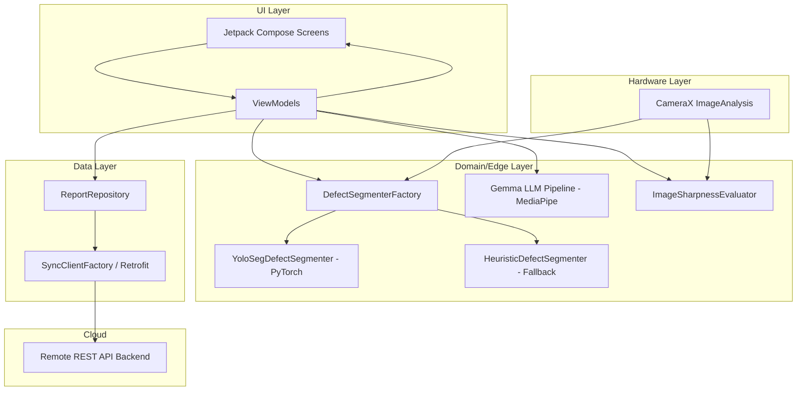

# App Architecture & Technologies

This document provides a detailed overview of the technologies used in the SmartLease Edge Chennai application, why they were chosen, and the overall system architecture.

## Technologies Used

### Frontend (Android / Edge Device)
*   **Language:** Kotlin
    *   *Why:* Kotlin is the modern, official language for Android development. It provides null safety, coroutines for efficient asynchronous programming (critical for ML and camera tasks), and a concise syntax compared to Java.
*   **UI Framework:** Jetpack Compose
    *   *Why:* Jetpack Compose is a declarative UI framework that vastly simplifies Android UI development. It allows for dynamic, reactive UIs that automatically update when the underlying state changes. We use Material 3 for the design system.
*   **Computer Vision & Camera:** CameraX
    *   *Why:* CameraX provides a consistent camera experience across different Android devices. It simplifies use cases like previewing frames, capturing images, and importantly, `ImageAnalysis` which feeds raw frames directly into our ML pipelines.
*   **On-Device Machine Learning (ML):**
    *   **MediaPipe (`tasks-genai` & `tasks-vision`):** Used for running LLMs (like Gemma) and vision tasks on the edge. MediaPipe is highly optimized for Android.
    *   **PyTorch Lite:** Used for running custom PyTorch models like the `YoloSegDefectSegmenter` for defect detection.
    *   *Why:* Running ML on the edge (device) ensures privacy, reduces latency (no round-trip to a cloud server), and works completely offline.

### Backend (Synchronization & API)
*   **Networking:** Retrofit & OkHttp
    *   *Why:* Retrofit is the industry standard for building type-safe REST clients on Android. It handles JSON serialization/deserialization (via kotlinx.serialization) and network execution (via OkHttp).
*   **Backend Architecture (Conceptual):**
    *   The app communicates with a remote backend via a REST API (e.g., `/api/v1/reports`).
    *   The backend's primary role is data aggregation, long-term storage of inspection reports, and potentially larger-scale data analytics.
    *   *Why a thin backend?* By moving the heavy lifting (defect detection, LLM analysis) to the "edge" (the phone), the backend only needs to handle lightweight JSON payloads (inspection reports), dramatically reducing cloud computing costs.

---

## System Architecture

The application follows a modern **Edge-Heavy Architecture** using the **Model-View-ViewModel (MVVM)** design pattern on the Android client.

### Key Components:
1.  **UI Layer (`ui/screens`):** Displays data and captures user input. For example, `VideoCaptureScreen` renders the camera preview and overlays defect bounding boxes in real-time.
2.  **Domain/Edge Layer (`domain`, `ml`):** This is where the core logic lives. 
    *   The `DefectSegmenterFactory` dynamically selects the best defect detection model (preferring PyTorch YOLO if available).
    *   The Gemma LLM Pipeline uses MediaPipe to generate human-readable summaries of the defects found.
3.  **Hardware Layer:** CameraX continuously pushes frames to the domain layer for real-time analysis.
4.  **Data Layer (`sync`):** The `HttpReportSyncClient` packages the on-device analysis (counts, defect types, LLM summaries) and synchronizes it with the remote backend when connectivity is available.
